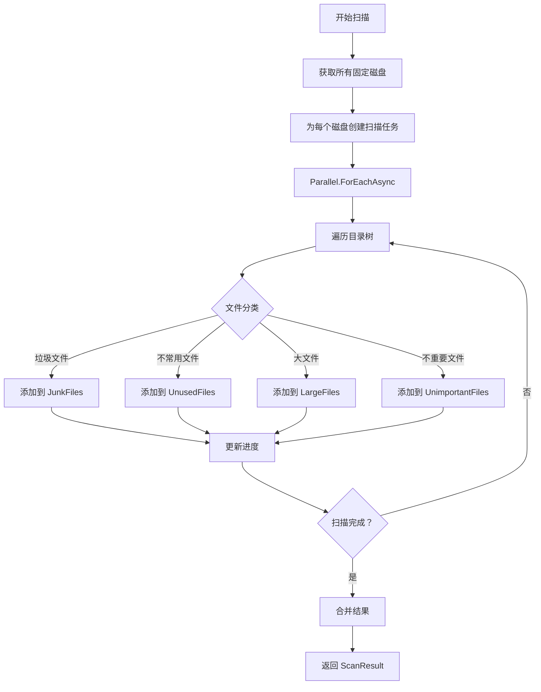
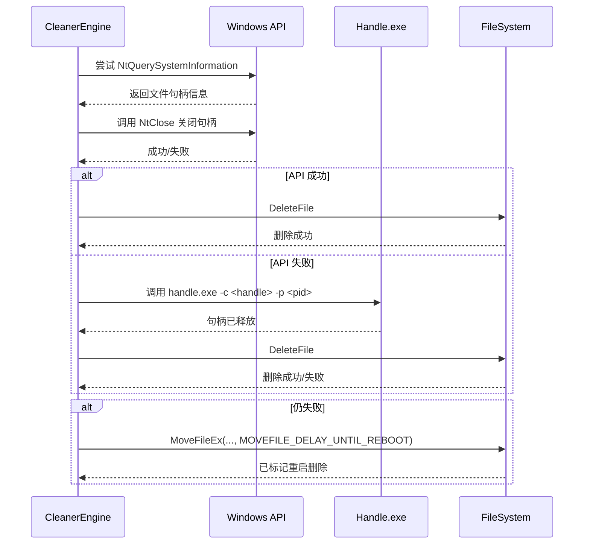
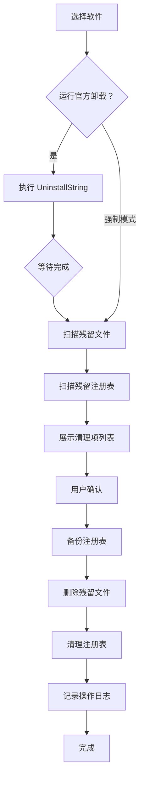
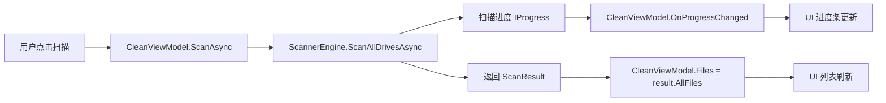

# DiskCleaner 技术设计文档

## 文档信息

- **版本号**: 1.0
- **创建日期**: 2026-05-17
- **最后更新**: 2026-05-17
- **状态**: 草案

---

## 1. 系统架构

### 1.1 整体架构图

```
┌─────────────────────────────────────────────────────────────────┐
│                        DiskCleaner Application                   │
├─────────────────────────────────────────────────────────────────┤
│  ┌─────────────┐  ┌─────────────┐  ┌─────────────────────────┐  │
│  │   Views     │  │ ViewModels  │  │      Services           │  │
│  │  (WinUI 3)  │◄─┤   (MVVM)    │◄─┤  - FileService          │  │
│  │             │  │             │  │  - ProcessService       │  │
│  │ - MainView  │  │ - MainVM    │  │  - RegistryService      │  │
│  │ - CleanView │  │ - CleanVM   │  │  - ScanService          │  │
│  │ - Uninstall │  │ - UninstallVM│ │  - UninstallService     │  │
│  └─────────────┘  └─────────────┘  └─────────────────────────┘  │
│           ▲                ▲                      ▲              │
│           │                │                      │              │
│  ┌────────┴────────────────┴──────────────────────┴──────────┐  │
│  │                      Core Layer                            │  │
│  │  ┌──────────┐  ┌──────────┐  ┌──────────┐  ┌──────────┐  │  │
│  │  │ Scanning │  │ Cleaning │  │ Uninstall│  │ Registry │  │  │
│  │  │  Engine  │  │  Engine  │  │  Engine  │  │  Engine  │  │  │
│  │  └──────────┘  └──────────┘  └──────────┘  └──────────┘  │  │
│  └───────────────────────────────────────────────────────────┘  │
│           ▲                ▲                      ▲              │
│  ┌────────┴────────────────┴──────────────────────┴──────────┐  │
│  │                     Models Layer                           │  │
│  │  - FileInfoModel  - InstalledSoftware  - ScanResult       │  │
│  │  - CleanConfig    - UninstallResult   - SystemInfo        │  │
│  └───────────────────────────────────────────────────────────┘  │
├─────────────────────────────────────────────────────────────────┤
│                    Windows API / P/Invoke                        │
│  - NtQuerySystemInformation  - MoveFileEx  - RegOpenKeyEx      │
│  - CloseHandle               - SuspendProcess - DeleteFile     │
└─────────────────────────────────────────────────────────────────┘
```

### 1.2 技术栈

| 层次 | 技术选型 | 版本 |
|------|----------|------|
| UI 框架 | WinUI 3 (Windows App SDK) | 1.5+ |
| 语言 | C# | 12.0 (.NET 8) |
| 架构模式 | MVVM | - |
| 依赖注入 | Microsoft.Extensions.DependencyInjection | 8.0 |
| 异步编程 | async/await + TPL | - |
| 本地 API | P/Invoke (Windows API) | - |
| 打包格式 | Single File EXE (Self-contained) | - |

### 1.3 项目结构

```
DiskCleaner/
├── src/DiskCleaner/
│   ├── Core/
│   │   ├── Scanning/
│   │   │   ├── ScannerEngine.cs
│   │   │   ├── FileClassifier.cs
│   │   │   ├── ScanOptions.cs
│   │   │   └── ScanResult.cs
│   │   ├── Cleaning/
│   │   │   ├── CleanerEngine.cs
│   │   │   ├── DeleteStrategy.cs
│   │   │   └── CleanResult.cs
│   │   ├── Uninstall/
│   │   │   ├── UninstallEngine.cs
│   │   │   ├── SoftwareInfo.cs
│   │   │   └── UninstallResult.cs
│   │   └── Registry/
│   │       ├── RegistryScanner.cs
│   │       ├── RegistryCleaner.cs
│   │       └── RegistryBackup.cs
│   ├── UI/
│   │   ├── Views/
│   │   │   ├── MainWindow.xaml
│   │   │   ├── CleanView.xaml
│   │   │   └── UninstallView.xaml
│   │   ├── ViewModels/
│   │   │   ├── MainViewModel.cs
│   │   │   ├── CleanViewModel.cs
│   │   │   └── UninstallViewModel.cs
│   │   ├── Controls/
│   │   │   ├── FileListItem.xaml
│   │   │   └── SoftwareListItem.xaml
│   │   └── Converters/
│   │       ├── FileSizeConverter.cs
│   │       └── FileTypeToColorConverter.cs
│   ├── Services/
│   │   ├── FileService.cs
│   │   ├── ProcessService.cs
│   │   ├── RegistryService.cs
│   │   ├── SystemInfoService.cs
│   │   └── ConfigService.cs
│   ├── Models/
│   │   ├── FileEntry.cs
│   │   ├── InstalledSoftware.cs
│   │   ├── ScanConfiguration.cs
│   │   └── AppSettings.cs
│   ├── Helpers/
│   │   ├── NativeMethods.cs
│   │   ├── PrivilegeHelper.cs
│   │   ├── AcrylicHelper.cs
│   │   └── FileHashHelper.cs
│   ├── Assets/
│   │   └── Handle/
│   │       └── handle.exe
│   ├── App.xaml
│   ├── App.xaml.cs
│   └── DiskCleaner.csproj
├── build/                    # .gitignore, 由 CI 生成
├── .github/workflows/
│   └── build-exe.yml
├── .gitignore
├── Directory.Build.props
└── DiskCleaner.sln
```

---

## 2. 核心模块设计

### 2.1 扫描引擎 (ScannerEngine)

#### 2.1.1 类图

```
┌─────────────────────────────────────┐
│         ScannerEngine               │
├─────────────────────────────────────┤
│ - _options: ScanOptions             │
│ - _cancellationToken: CancellationTokenSource │
│ - _progress: IProgress<ScanProgress>│
├─────────────────────────────────────┤
│ + ScanAllDrivesAsync(): Task<ScanResult>    │
│ + ScanDriveAsync(drive: DriveInfo): Task    │
│ + ScanDirectoryAsync(path: string): Task    │
│ + ClassifyFile(path: string): FileType      │
│ + Cancel(): void                            │
└─────────────────────────────────────┘
            ▲
            │ uses
┌─────────────────────────────────────┐
│        FileClassifier               │
├─────────────────────────────────────┤
│ + IsJunkFile(path): bool            │
│ + IsUnusedFile(path, days): bool    │
│ + IsLargeFile(path, sizeThreshold): bool │
│ + IsUnimportantFile(path): bool     │
│ + GetDuplicateFiles(files): Grouped │
└─────────────────────────────────────┘
```

#### 2.1.2 扫描流程



#### 2.1.3 关键接口

```csharp
public interface IScannerEngine
{
    Task<ScanResult> ScanAllDrivesAsync(
        ScanOptions options,
        IProgress<ScanProgress> progress,
        CancellationToken cancellationToken);
    
    void Cancel();
}

public record ScanOptions
{
    public bool ScanJunkFiles { get; init; } = true;
    public bool ScanUnusedFiles { get; init; } = true;
    public bool ScanLargeFiles { get; init; } = true;
    public bool ScanUnimportantFiles { get; init; } = true;
    public int UnusedDaysThreshold { get; init; } = 90;
    public long LargeFileSizeThreshold { get; init; } = 500 * 1024 * 1024; // 500MB
    public string[]? CustomPaths { get; init; }
}

public record ScanProgress
{
    public string CurrentDirectory { get; init; } = "";
    public int FilesFound { get; init; }
    public long TotalSizeScanned { get; init; }
    public double ProgressPercentage { get; init; }
}

public record ScanResult
{
    public IReadOnlyList<FileEntry> JunkFiles { get; init; } = new List<FileEntry>();
    public IReadOnlyList<FileEntry> UnusedFiles { get; init; } = new List<FileEntry>();
    public IReadOnlyList<FileEntry> LargeFiles { get; init; } = new List<FileEntry>();
    public IReadOnlyList<FileEntry> UnimportantFiles { get; init; } = new List<FileEntry>();
    public DateTime ScanTime { get; init; }
    public TimeSpan Duration { get; init; }
}
```

### 2.2 清理引擎 (CleanerEngine)

#### 2.2.1 删除策略模式

```
┌─────────────────────────────────┐
│      interface IDeleteStrategy  │
├─────────────────────────────────┤
│ + DeleteAsync(file: FileEntry,  │
│     force: bool): Task<DeleteResult> │
└─────────────────────────────────┘
                ▲
    ┌───────────┼───────────┐
    │           │           │
┌───┴───┐  ┌────┴────┐  ┌───┴────┐
│Normal │  │ Force   │  │ Restart │
│Delete │  │ Delete  │  │ Delete  │
├───────┤  ├─────────┤  ├─────────┤
│DeleteFile│ │API +  │  │MoveFileEx│
│         │ │Handle │  │  + 重启  │
└───────┘  └─────────┘  └─────────┘
```

#### 2.2.2 强制删除流程



### 2.3 卸载引擎 (UninstallEngine)

#### 2.3.1 软件信息模型

```csharp
public record InstalledSoftware
{
    public string DisplayName { get; init; } = "";
    public string? Publisher { get; init; }
    public string? DisplayVersion { get; init; }
    public string? InstallDate { get; init; }
    public long? EstimatedSize { get; init; } // KB
    public string? UninstallString { get; init; }
    public string? InstallLocation { get; init; }
    public string? DisplayIcon { get; init; }
    public RegistryHive RegistryHive { get; init; }
    public string RegistryKey { get; init; } = "";
    public bool Is64Bit { get; init; }
}

public record UninstallOptions
{
    public bool RunOfficialUninstaller { get; init; } = true;
    public bool SilentUninstall { get; init; } = false;
    public bool ScanResidualFiles { get; init; } = true;
    public bool ScanResidualRegistry { get; init; } = true;
    public bool CreateRestorePoint { get; init; } = false;
    public bool BackupRegistry { get; init; } = true;
}
```

#### 2.3.2 卸载流程



### 2.4 注册表服务 (RegistryService)

#### 2.4.1 备份机制

```csharp
public class RegistryBackup
{
    public string BackupPath { get; } = 
        Path.Combine(
            Environment.GetFolderPath(Environment.SpecialFolder.LocalApplicationData),
            "DiskCleaner",
            "backup");
    
    public Task<string> BackupKeyAsync(
        RegistryHive hive, 
        string subKey);
    
    public Task RestoreFromBackupAsync(string backupFile);
    
    public Task CleanupOldBackupsAsync(int daysToKeep = 7);
}
```

---

## 3. UI 层设计

### 3.1 WinUI 3 窗口架构

```csharp
// App.xaml.cs
public partial class App : Application
{
    private IHost _host;
    
    public App()
    {
        _host = Host.CreateDefaultBuilder()
            .ConfigureServices((context, services) =>
            {
                services.AddSingleton<IScannerEngine, ScannerEngine>();
                services.AddSingleton<ICleanerEngine, CleanerEngine>();
                services.AddSingleton<IUninstallEngine, UninstallEngine>();
                services.AddSingleton<IRegistryService, RegistryService>();
                services.AddSingleton<MainWindow>();
                services.AddSingleton<MainViewModel>();
                services.AddSingleton<CleanViewModel>();
                services.AddSingleton<UninstallViewModel>();
            })
            .Build();
    }
    
    public static T GetService<T>() => 
        ((App)Current)._host.Services.GetRequiredService<T>();
}
```

### 3.2 毛玻璃效果实现

```csharp
// Helpers/AcrylicHelper.cs
public static class AcrylicHelper
{
    public static void ApplyAcrylic(Window window)
    {
        if (Environment.OSVersion.Version.Build >= 22000) // Windows 11
        {
            var micaBackdrop = new MicaBackdrop();
            window.SystemBackdrop = micaBackdrop;
        }
        else if (Environment.OSVersion.Version.Build >= 18362) // Windows 10 1903+
        {
            var acrylicBackdrop = new DesktopAcrylicBackdrop();
            window.SystemBackdrop = acrylicBackdrop;
        }
    }
    
    public static void ApplyLiquidAnimation(UIElement element)
    {
        var visual = ElementCompositionPreview.GetElementVisual(element);
        var compositor = visual.Compositor;
        
        var propertySet = compositor.CreatePropertySet();
        propertySet.InsertScalar("Progress", 0f);
        
        var animation = compositor.CreateExpressionAnimation();
        animation.Expression = "Progress * 0.1";
        animation.SetReferenceParameter("visual", visual);
        
        visual.StartAnimation("Scale.X", animation);
        visual.StartAnimation("Scale.Y", animation);
    }
}
```

### 3.3 主窗口布局

```xaml
<!-- Views/MainWindow.xaml -->
<Window
    x:Class="DiskCleaner.UI.Views.MainWindow"
    xmlns="http://schemas.microsoft.com/winfx/2006/xaml/presentation"
    xmlns:x="http://schemas.microsoft.com/winfx/2006/xaml"
    xmlns:controls="using:DiskCleaner.UI.Controls"
    Title="DiskCleaner"
    Width="1200"
    Height="800">
    
    <Grid>
        <Grid.ColumnDefinitions>
            <ColumnDefinition Width="Auto"/>
            <ColumnDefinition Width="*"/>
        </Grid.ColumnDefinitions>
        
        <!-- 左侧导航 -->
        <NavigationView
            x:Name="NavView"
            Grid.Column="0"
            PaneDisplayMode="Left"
            IsPaneToggleButtonVisible="False"
            SelectionChanged="NavView_SelectionChanged">
            
            <NavigationView.MenuItems>
                <NavigationViewItem Icon="Clean" Content="清理"/>
                <NavigationViewItem Icon="Delete" Content="软件卸载"/>
                <NavigationViewItem Icon="Setting" Content="设置"/>
            </NavigationView.MenuItems>
            
            <Frame x:Name="ContentFrame"/>
        </NavigationView>
        
        <!-- 内容区域 -->
        <Grid Grid.Column="1">
            <!-- 由 Frame 导航管理 -->
        </Grid>
    </Grid>
</Window>
```

---

## 4. 数据流设计

### 4.1 扫描数据流



### 4.2 MVVM 绑定关系

```
┌─────────────┐      ┌─────────────┐      ┌─────────────┐
│   View      │◄────►│  ViewModel  │◄────►│    Model    │
│  (XAML)     │      │   (C#)      │      │   (C#)      │
├─────────────┤      ├─────────────┤      ├─────────────┤
│ FilesList   │──┐   │ Files       │──┐   │ FileEntry   │
│ (ListView)  │  │   │ (Observable │  │   │ (Record)    │
│             │  │   │  Collection)│  │   │             │
│ ProgressBar │──┼──►│ ScanProgress│  │   │ ScanResult  │
│             │  │   │ (Property)  │  │   │ (Record)    │
│ DeleteBtn   │──┘   │ DeleteCmd   │──┘   │             │
│ (Button)    │      │ (ICommand)  │      │             │
└─────────────┘      └─────────────┘      └─────────────┘
```

---

## 5. 错误处理策略

### 5.1 全局异常处理

```csharp
public partial class App : Application
{
    protected override void OnStartup(StartupEventArgs e)
    {
        AppDomain.CurrentDomain.UnhandledException += (s, args) =>
        {
            Logger.Fatal(args.ExceptionObject as Exception, "全局未处理异常");
            ShowErrorDialog("发生严重错误，请查看日志文件");
        };
        
        DispatcherUnhandledException += (s, args) =>
        {
            Logger.Error(args.Exception, "UI 线程未处理异常");
            args.Handled = true;
            ShowErrorDialog(args.Exception.Message);
        };
        
        TaskScheduler.UnobservedTaskException += (s, args) =>
        {
            Logger.Error(args.Exception, "Task 未处理异常");
            args.SetObserved();
        };
    }
}
```

### 5.2 服务层异常包装

```csharp
public class ScanException : Exception
{
    public ScanException(string message, Exception? inner = null) 
        : base(message, inner) { }
}

public class DeleteException : Exception
{
    public string FilePath { get; }
    
    public DeleteException(string filePath, string message, Exception? inner = null)
        : base(message, inner)
    {
        FilePath = filePath;
    }
}

public class UninstallException : Exception
{
    public string SoftwareName { get; }
    
    public UninstallException(string softwareName, string message, Exception? inner = null)
        : base(message, inner)
    {
        SoftwareName = softwareName;
    }
}
```

---

## 6. 配置文件设计

### 6.1 config.json 结构

```json
{
  "ScanOptions": {
    "ScanJunkFiles": true,
    "ScanUnusedFiles": true,
    "ScanLargeFiles": true,
    "ScanUnimportantFiles": true,
    "UnusedDaysThreshold": 90,
    "LargeFileSizeThresholdMB": 500,
    "CustomPaths": []
  },
  "JunkFileRules": {
    "ScanTempFolders": true,
    "ScanBrowserCache": true,
    "ScanRecycleBin": true,
    "ScanLogFiles": true,
    "ScanUpdateCache": true
  },
  "Security": {
    "WhitelistPaths": [
      "C:\\Windows\\System32",
      "C:\\Program Files\\WindowsApps"
    ],
    "RequireConfirmForProtectedFiles": true
  },
  "UI": {
    "Language": "zh-CN",
    "Theme": "Auto",
    "EnableAnimations": true
  },
  "Logging": {
    "LogLevel": "Information",
    "LogPath": "%TEMP%\\DiskCleaner\\logs"
  }
}
```

---

## 7. GitHub Actions 工作流设计

### 7.1 工作流配置

```yaml
name: Build EXE

on:
  push:
    branches: [ main ]
  workflow_dispatch:

jobs:
  build:
    runs-on: windows-latest
    
    steps:
    - uses: actions/checkout@v4
    
    - name: Setup .NET 8
      uses: actions/setup-dotnet@v4
      with:
        dotnet-version: '8.0.x'
    
    - name: Restore NuGet packages
      run: dotnet restore
    
    - name: Build with retry
      uses: nick-fields/retry@v3
      with:
        timeout_minutes: 15
        max_attempts: 3
        retry_wait_seconds: 10
        command: |
          dotnet publish src/DiskCleaner/DiskCleaner.csproj `
            -c Release `
            -r win-x64 `
            --self-contained true `
            -p:PublishSingleFile=true `
            -p:EnableCompressionInSingleFile=true `
            -p:WindowsPackageType=None `
            -o build
    
    - name: Verify EXE exists
      run: |
        if (Test-Path build/DiskCleaner.exe) {
          Write-Host "✓ Build succeeded"
        } else {
          Write-Error "✗ Build failed - EXE not found"
          exit 1
        }
    
    - name: Upload artifact
      uses: actions/upload-artifact@v4
      with:
        name: DiskCleaner-EXE
        path: build/DiskCleaner.exe
        retention-days: 30
    
    - name: Commit to build directory
      run: |
        git config --global user.name "github-actions[bot]"
        git config --global user.email "github-actions[bot]@users.noreply.github.com"
        git add build/*
        git commit -m "🔨 Build ${{ github.sha }} succeeded [skip ci]" || echo "No changes"
        git push
      env:
        GITHUB_TOKEN: ${{ secrets.GITHUB_TOKEN }}
    
    - name: Create GitHub Release
      uses: softprops/action-gh-release@v1
      with:
        tag_name: Build-${{ github.run_number }}-${{ github.sha }}
        name: "Build ${{ github.run_number }} - ${{ github.event.head_commit.message }}"
        files: build/DiskCleaner.exe
        generate_release_notes: true
        fail_on_unmatched_files: false
```

---

## 8. Native API 封装

### 8.1 P/Invoke 定义

```csharp
internal static partial class NativeMethods
{
    [LibraryImport("ntdll.dll")]
    [return: MarshalAs(UnmanagedType.I4)]
    public static partial int NtQuerySystemInformation(
        int SystemInformationClass,
        nint SystemInformation,
        int SystemInformationLength,
        out int ReturnLength);
    
    [LibraryImport("kernel32.dll", SetLastError = true)]
    [return: MarshalAs(UnmanagedType.Bool)]
    public static partial bool MoveFileEx(
        string lpExistingFileName,
        string? lpNewFileName,
        uint dwFlags);
    
    [LibraryImport("kernel32.dll", SetLastError = true)]
    [return: MarshalAs(UnmanagedType.Bool)]
    public static partial bool DeleteFile(string lpFileName);
    
    [LibraryImport("kernel32.dll", SetLastError = true)]
    [return: MarshalAs(UnmanagedType.Bool)]
    public static partial bool CloseHandle(nint hObject);
    
    [DllImport("advapi32.dll", SetLastError = true)]
    [return: MarshalAs(UnmanagedType.Bool)]
    public static extern bool OpenProcessToken(
        nint ProcessHandle,
        uint DesiredAccess,
        out nint TokenHandle);
    
    [DllImport("advapi32.dll", SetLastError = true)]
    [return: MarshalAs(UnmanagedType.Bool)]
    public static extern bool AdjustTokenPrivileges(
        nint TokenHandle,
        [MarshalAs(UnmanagedType.Bool)] bool DisableAllPrivileges,
        ref TOKEN_PRIVILEGES NewState,
        int BufferLength,
        nint PreviousState,
        nint ReturnLength);
    
    public const uint TOKEN_ADJUST_PRIVILEGES = 0x0020;
    public const uint TOKEN_QUERY = 0x0008;
    public const uint SE_PRIVILEGE_ENABLED = 0x00000002;
    public const uint MOVEFILE_DELAY_UNTIL_REBOOT = 0x00000004;
}
```

---

## 9. 性能优化策略

### 9.1 扫描性能优化

- 使用 `Parallel.ForEachAsync` 限制并发度（默认 4）
- 使用 `Channel<T>` 实现生产者 - 消费者模式
- 大目录扫描使用异步 IO（`Directory.GetFilesAsync` 封装）
- 文件哈希计算使用增量 MD5（仅前 4KB）
- 使用 `ConcurrentBag<T>` 避免锁竞争

### 9.2 UI 性能优化

- 文件列表使用虚拟化（`ListView` 默认支持）
- 图片/图标异步加载
- 进度更新节流（100ms 间隔）
- 使用 `DispatcherQueue.TryEnqueue` 避免跨线程访问

### 9.3 内存优化

- 扫描结果分页加载（每页 1000 项）
- 大文件列表使用增量加载
- 及时释放未使用的资源（`IDisposable` 模式）

---

## 10. 测试策略

### 10.1 单元测试

- Core 层业务逻辑（扫描规则、分类逻辑）
- ViewModel 命令和属性
- 配置文件读写

### 10.2 集成测试

- 扫描真实目录
- 文件删除流程
- 注册表备份与恢复

### 10.3 手工测试

- UI 交互测试
- 毛玻璃效果验证
- 强制删除功能验证
- 软件卸载功能验证

---

## 11. 部署与发布

### 11.1 发布命令

```bash
dotnet publish src/DiskCleaner/DiskCleaner.csproj `
  -c Release `
  -r win-x64 `
  --self-contained true `
  -p:PublishSingleFile=true `
  -p:EnableCompressionInSingleFile=true `
  -p:WindowsPackageType=None `
  -o build
```

### 11.2 EXE 签名（可选）

使用自签名证书或商业证书对 EXE 进行签名，避免 Windows SmartScreen 警告。

---

## 12. 参考文献

- [Windows App SDK](https://docs.microsoft.com/windows/apps/windows-app-sdk/)
- [WinUI 3 Gallery](https://github.com/microsoft/WinUI-Gallery)
- [.NET 8 Single File](https://learn.microsoft.com/dotnet/core/deploying/single-file/)
- [Sysinternals Handle](https://learn.microsoft.com/sysinternals/downloads/handle)
